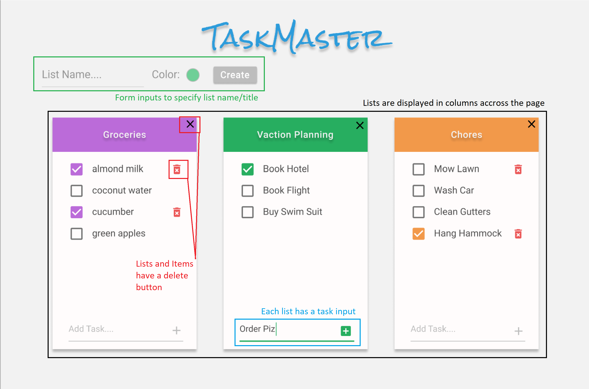

# TaskMaster

## Goals

For this checkpoint students will be responsible for creating a task manager, where users can create multiple lists each with multiple items to complete on that list.

They will demonstrate their understanding of the MVC Design pattern by completing this process utilizing services, controllers and models. In addition students will be able to persist data into local storage that will be retrieved on page refresh.

## The Setup

### Step 1

There has been a bit of code provided at the start of this project, with some notes and flagged `TODO` items throughout. Read through all the code that exists already before diving into the project.

It may also be beneficial to draw out a template of both the page layout, and the processes that will be needed for each part to work as anticipated. Use this template as you are writing code to better focus your efforts on what you may or may not need to achieve your goals.

### Step 2

Dive right into the coding, it doesn't matter which step below you do first however the following is a broad scope of the things that need to be done:

- Create a data model for what your list is, and the properties you need on it. This should at least include a title, and a list of items it includes.
- Generate the HTML needed to create a new list
- In your controller capture the form submission and pass the data to your service, ensure the page does not reload.
- Your service is responsible to turn your raw data into a List class object, and put it in the state (REMINDER: You will also want to make sure this gets saved in your local storage)
- Write the needed function to render your list to the screen.
- Repeat a similar process for deleting a list and creating and deleting Items (NOTE: you may not need Items to be their own class, as they are likely just a string).

## Requirements:

#### Visualization

- All lists are Rendered on load/reload
- Lists are displayed out in columns across the page
- Lists and Items each have a delete button
- Lists utilize form inputs so users can specify a name/title
- Each List has a form so Items can be added to the List

#### Functionality

- Lists can be Created and Deleted
- Items can be Created and Deleted
- Data persists through local storage
- Users are prompted to confirm any delete (search window.confirm)

### Stretch Goals (Requirements first! Then stretch goals.)

- Use a 'color' input so users can set the color for their list.
- List items can be marked 'complete' separately from being deleted
- Use something like masonry to render the lists more elegantly
- Use a better popup then window.confirm for a more clean user experience (see the SweetAlertJS documentation for ideas on this)
